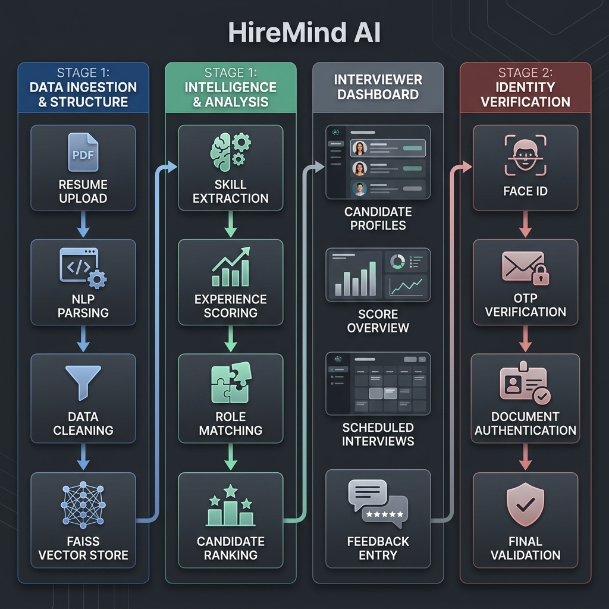

# 🧠 HireMind AI: 🎯 High-Performance Autonomous HR Operating System

HireMind AI is a premium, multi-layered recruitment platform that transforms traditional hiring into an **AI-driven workflow**. From resume screening and semantic ranking to voice-based interviews and automated hiring, HireMind AI serves as a complete autonomous backend for modern HR teams.



---

## 🚀 Core Intelligence Phases

### 1. 🔍 Precision Screening (Stage 1)
*   **Semantic Vector Matching**: Powered by **FAISS** and **Sentence Transformers**, the system maps resumes to job descriptions based on context, not just keywords.
*   **ATS Logic Engine**: A deterministic scoring system that evaluates formatting, section presence, and experience structure.
*   **Fraud Detection**: Real-time detection of hidden text, keyword stuffing, and temporal inconsistencies in candidate data.

### 2. 🛡️ Identity & Integrity Verification
*   **Facial Recognition**: compares the photo extracted from the PDF resume against a live webcam capture using **dlib** and **HOG** encodings.
*   **Secure OTP Gateway**: Seamless email-based verification to ensure candidate ownership of data.
*   **Webcam Proctoring**: Continuous face detection and head-pose monitoring using **MediaPipe** to prevent cheating during interview rounds.

### 3. 🎙️ AI Voice Interview (Stage 2)
*   **Personalized Interviewing**: **Google Gemini** analyzes screening gaps to generate tailored technical and behavioral questions.
*   **Speech Intelligence**: High-accuracy transcription powered by **AssemblyAI (Universal-3-pro)**.
*   **Audio UX**: Professional text-to-speech interaction using **gTTS**, creating a conversational interview environment.

### 4. 💼 Premium Admin Control Center
*   **Applicant Ranking**: Holistic view of all candidates sorted by a combined **ATS Score + Normalized Interview Score**.
*   **Deep-Dive Reporting**: One-click candidate reports featuring AI-driven hireability verdicts and detailed answer feedback.
*   **Automated Hiring**: Integrated **Resend API** for one-click "Selection" emails and automated database updates.

---

## 🛠️ Technology Stack

| Layer | Technologies |
| :--- | :--- |
| **Frontend** | Streamlit (Python Core), Custom CSS3 with Glassmorphism |
| **LLM / AI** | Google Gemini 1.5 Pro |
| **NLP** | spaCy (en_core_web_md), Sentence-Transformers |
| **Vector DB** | FAISS (Meta AI Similarity Search) |
| **Speech** | AssemblyAI (STT), Google gTTS (TTS) |
| **Vision** | MediaPipe (Face Detection), dlib (Recognition) |
| **Database** | SQLite3 (Relational Management) |
| **Post** | Resend API (Email Automation) |

---

## ⚙️ Setup & Deployment

1. **Clone & Environment**
   ```bash
   git clone https://github.com/Bhavesh1411/Hiremind-AI.git
   cd Hiremind-AI
   ```

2. **Configuration (`.env`)**
   ```env
   GEMINI_API_KEY=your_key_here
   ASSEMBLYAI_API_KEY=your_key_here
   RESEND_API_KEY=your_key_here
   ```

3. **Install Dependencies**
   ```bash
   pip install -r requirements.txt
   python -m spacy download en_core_web_md
   ```

4. **Run Application**
   ```bash
   streamlit run app.py
   ```

---

**Developed by Bhavesh** | *HireMind AI: Setting the benchmark for Intelligent Recruitment.*
